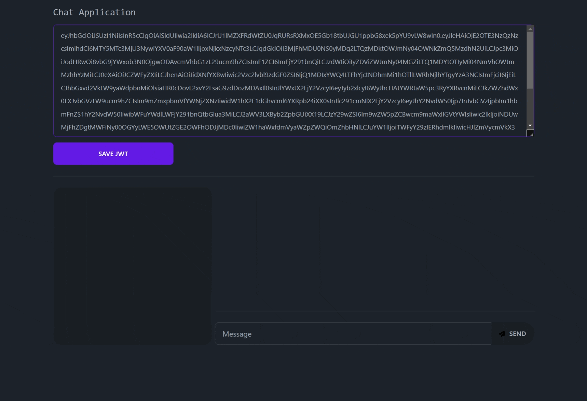

## Challenge (Spanish)

Se pide crear un sistema de buses que maneje una serie de itinerarios de lima hacia todas las demás provincias.
Considerar los siguientes criterios:

1. Los buses se identifican por placa y operador.
2. Los itinerarios deben tener la siguiente información:
    - Ciudad de origen
    - Ciudad de destino
    - Horario de salida
    - Horario de llegada
    - Precio del pasaje
    - Bus asignado
3. Los buses tendrán un mínimo de 20 asientos y un máximo de 35.
4. Habrá 3 tipos de asientos: Turista, Ejecutivo, Premium. Cada uno de ellos tendrá un valor agregado que lo manejará a criterio del desarrollador.
5. Los usuarios deben poder buscar itinerarios disponibles por ciudad de origen y destino, y reservar su asiento en el bus seleccionado.
6. El sistema debe permitir agregar y actualizar itinerarios, así como revisar las reservas realizadas en sus buses.
7. Se debe implementar un carrito de compras por usuario tipo pasajero, el usuario puede comprar la cantidad de tickets que requiera.
8. Se debe hacer uso de una base de datos relacional.
9. Se tendrán 2 tipos de usuarios:
    - Usuario onroad: Podrá realizar todas las acciones del sistema basado en privilegios de escritura, lectura.
    - Usuario pasajero: Usuario tipo cliente que abordará los buses.
10. Se pide una mensajería de chat en tiempo real entre usuarios tipo onroad para poder realizar coordinaciones internas.

## Requirements

- Node.js v.18
- Docker

## Setup & Installation

Clone the repository and install the dependencies.

```bash
$ npm install
```

Then copy the file `.env.copy` to `.env` and finally run the docker dependencies.

```bash
$ docker-compose up -d
```

#### Important Steps
Since it is a microservices architecture with two applications. We must create a database or schema for each application. So go to the sql editor and run the following:

```sql
CREATE SCHEMA IF NOT EXISTS bus_app;
CREATE SCHEMA IF NOT EXISTS chat_app;
```

Now you can populate your database

```bash
$ npm run db:seed:bus
```

It is also important to configure the authentication server to make the chat work.

You can follow the steps directly in the official keycloak documentation: https://www.keycloak.org/getting-started/getting-started-docker

The chat application is located at http://localhost:3001/sample-chat
<!-- Chat sample -->


## Running the app
There are two applications to run, so you have to start each one individually.

```bash
# development
$ npm run start bus|chat

# watch mode
$ npm run start:dev bus|chat

# production mode
$ npm run start:prod bus|chat
```

## Enjoy
That's all